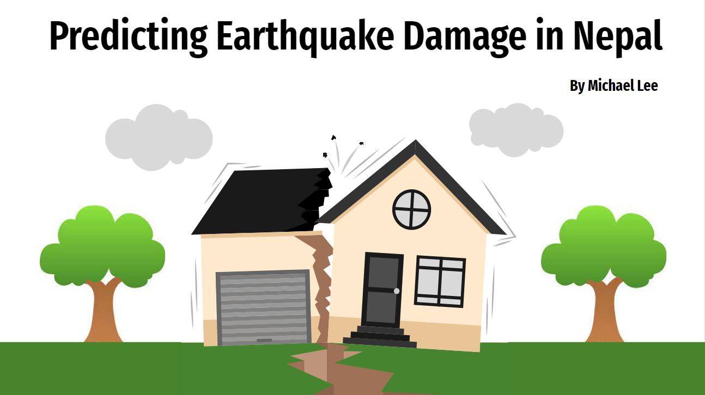
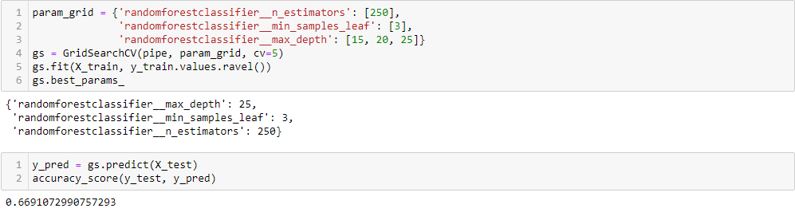

# ABSTRACT

Earthquakes happen unexpectedly and sometimes, violently. We normally don't think about it in our daily lives, but we always do after the destruction. There are laws to help mitigate the damage of earthquakes, especially in areas with many titonic plates, but now we can take action to mitigate those damages before hand, through the power of data

# Business Problem

The Nepalese government wants to find out how to minimalize destruction. Using data collected from the Nepal Earthquake in 2015, build a predictive model to correctly classify how much damage a building will have based on its characteristics.

Because we are building a predictor for potentially remodeling some buildings, having false positives will be extremely expensive, and we definately do not want to miss false negatives as that could potentionally put lives at risk. Accuracy is a metric that is a combination of recall and precision.

We also found some class imbalance in our target variable, at about a 67 / 33 split. While it is not the perfect 50 / 50 split we would like, there should be enough data at this split to build a sufficient model.

# Data Understanding

Dataset information:


Because we are looking into the predicting total damage grade caused by the features of the house, house information such as building uses, secondard building uses, and ownership should have no effect in the overall damage caused by an earthquake. Thus, we dropped those columns, reducing our dataset about 33%.


Next, for the df_labels. Because we are interested in modeling for the major damage category, we relabeled 'light damage' and 'some damage' into one, '0', and 'major damage' as '1', turning our model into binary classifier. This introduced the potential 33/67 class imbalance split. But again, because the class imbalance is not too extreme, creating a model with this data should not be too big of an issue.

# Data Preparation

In order to create a better model - by 0.05 or 5%, we engineered a 'skinny_tall' category. If a building was taller than the average normalized height, but also had a smaller average normalized area (or base) of the building, it would be labeled as such. 

For buildings that were tall, but had a small base, they were much more likely to be near complete destruction compared to that of a regular building.


Next, we split the data up into train / test splits in order to have a validation set the train never 'sees'. 

For the remaining object types, we converted them into a categorical using OneHotEncoder and transforming both X_train and X_test so they are ready for modeling and validation.

# Modeling

## KNN

For our baseline model, we created a KNN with parameters (here) for an accuracy rate of (x%). The KNN model took an exceptionally long time because of the sheer size of our dataset and number of features. 
Utilizing GridSearchCV and pipelines, we were given this result:


The best chosen parameters are 5 neighbors with leaf size of 15, using the distance weight. Although we could try to tune the parameters, using the KNN model for this dataset takes too long to train.
Coupled with the low explainability, the KNN model is best left to the side while we explore potentionally better models.

## Logistic Regression

The Logistic Regression model scored an accuracy rate of (x%), which is higher than the previous KNN model. With much faster runtime, and easier interpretibility, the Logistic Regression model outclasses the KNN in pretty much every way.


Because our model does not seem to be overfitting / underfitting, we did not feel a need to add in regularization.

## Random Forest 

The Random Forest Classifier ended up being our best model. 

We first created a GridSearchCV pipeline with the RandomForestClassifier estimator combined with StandardScaler. Our Best iteration was with these hyper-parameters:


And the results:


To attempt a better accuracy score, we then tried to add a different hyper-parameter for Random Forests, max_depth:


The new hyper-parameter seem to hurt our model's accuracy instead of improving it. Lets see if we adjust, we can achieve a higher accuracy than without this hyper-parameter.



We did score a better betric, but the model is saying the optimal max_depth is somewhere between 25 and 30, but the current metric of 67% does not convince me that the perfect depth parameter will give us a model greater than 68.23% accuracy we achived without this parameter.

In conclusion:

With hpyer-parameters 150 estimators and min samples leaf of 5, the model scored an accuracy rate of 68.23%. While the Random Forest Classifier took longer than the Logistic Regression in training time, they share around the same level of explainability. And because we had enough resources and time to model using Random Forests, we chose to make it our final model.


# Results

Our business problem has no bias against false negatives / false positives, the accuracy score metric determined that the Random Forest Classifier is the best model with an F1 score of 68%.

The benefits of the Random Forest Classifier is the explainability of the model, meaning we can determine the most important features necessary for prediction. For more information on how we determined the most important features, check out our data_viz notebook!

# Data Limitations

The first glaring issue with our current dataset is it only contains records of buildings that were damamged in some way or form. This means that the most ideal houses - the buildings with no damage are not present for our model to train on. If we had access to that data, we could build a model on the important factors of having no damage, and potentionally improve our damage classifier model as well.

Secondly, because this data was comprised of buildings in Nepal, to have a a better application of the model for worldwide deployment, gathering similar information from our scenarios will make our model more univerally usable.

Lastly, looking into ways of predicting ways of when / where an earthquake will strike using data over time may be a possible future research.

# Conclusion

Since earthquakes can be sudden and violent, it is imperative that areas in risk of an earthquake, prepare before it is too late. With the help of our Random Forest Classifier, the main factors of building damage has been decoded from the code: foundation and superstructure. 
With an 68% accuracy, we are able to direct inspectors which buildings to inspect first for earthquake readiness to help prepare the country for the next major earthquake. 

If you are reading this, I sincerely appreciate you taking your time to look at my project. I hope you come out with new knowledge you may have not had before.

## For More Information

See the full analysis in the [Jupyter Notebook](./modeling_earthquake_damage.ipynb) or review this [Presentation](./presentation.pdf). For our full data preprocessing steps and exploratory data analysis, check out our [EDA Notebook Here](./EDA.ipynb)!

For additional info contact [Michael Lee](mailto:baekho5767@gmail.com)

## Repository Structure

You are in the README.md right now. If you want to take a look at our Jupyter Notebook, go to the 'modeling_earthquake_damage.ipynb' to find our data science steps for you to replicate! The 'data' folder contains the original and engineered feature datasets we used to train and validate our model. The 'images' folder contains the images used within this README. We hope you find our research informative!
```                              
├── data
├── images
├── .gitignore
├── EDA.ipynb
├── modeling_earthquake_damage.ipynb
├── presentation.pdf
└── README.md

